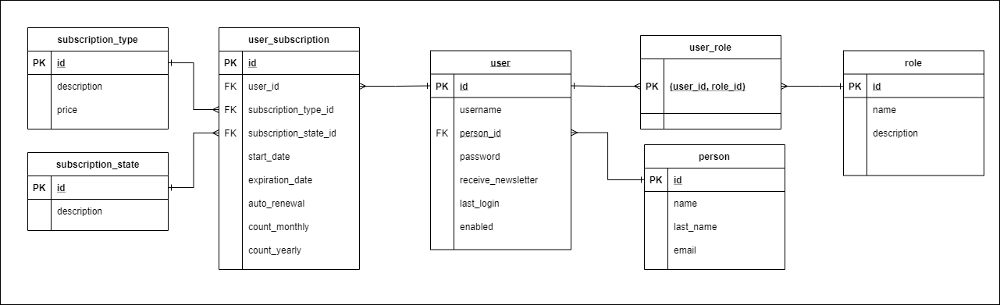

# EcommerceOST

## Installation

### Backend (Java and Spring Boot)

1. Clone the repository.
2. Open the project in your IDE.
3. Run the Spring Boot application.

### Frontend (React)

1. Navigate to the `front-end/ecommerce-react` folder.
2. Open the console in that folder.
3. Run `npm install` to install the dependencies.
4. Run `npm run dev` to run the React application.

### Database Setup (PostgreSQL and Docker)

- Ensure you have Docker installed.
- Navigate to the `ecommerce` folder.
- Run `docker-compose up -d db`

## Application Design

The application follows a layered architecture, separating concerns into presentation, business logic, and data access layers. 

### Security

- Passwords are stored encrypted.
- User management is handled using Spring Security with JWT implementation.

### Payment Gateway Integration

- Stripe is used for payment gateway integration.
- Integration is done using the Charges API.
  
Steps for processing the charge with Charge API:

1. Frontend app sending card data to Stripe 
2. Stripe returns token
3. Frontend app sending a token to the backend
4. The backend creates a Charge object and contacts Stripe with the token, amount, and secret key
5. The backend then provides a response to the frontend application

## Entity-Relationship Diagram (ERD)

# Endpoints

### User Registration
- **Endpoint:** `api/user/register`
- **Description:** Registers a new user with the required information (name, last name, username, email, password).
- **Method:** POST
- **Response:** Creates a new user.

### Login
- **Endpoint:** `api/login`
- **Description:** Allows access to the app by providing the username and password.
- **Method:** POST
- **Response:** Allows the user to log in.

### Stripe Payment
- **Endpoint:** `api/stripe/payment`
- **Description:** The backend creates a Charge object to continue with the charge process in Stripe.
- **Method:** POST
- **Response:** Initiates the charge process in Stripe.
- **Important:** To make a successful payment, use the credit card number 4242 4242 4242 4242.

### Subscription Succeeded
- **Endpoint:** `api/subscriptions/succeeded`
- **Description:** Updates the user's subscription information in the database upon successful payment registration through Stripe.
- **Method:** POST
- **Response:** Updates subscription information and keeps track of subscription types for future analysis.

### User Profile
- **Endpoint:** `api/user/profile`
- **Description:** Retrieves all relevant information about the logged-in user's profile, including personal data, subscription status, and subscriber-only content.
- **Method:** GET
- **Response:** Returns the user's profile information.